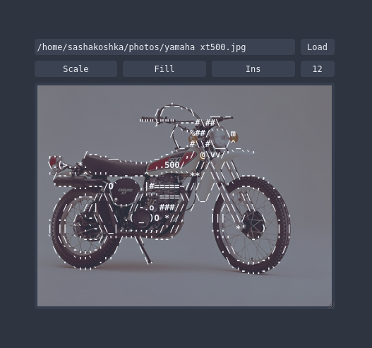

# asciitool

Tool to make ASCII art.

* Load: Loads the image from the filepath specified in the input box
* Scale/Stretch: Scales the image to fit, or stretches it
* Fill: (Work in progress) Fills the canvas with spaces
* Ins/Over: Sets insertion mode; Insert character at cursor, or overwrite character at cursor
* Font size: Changes the size of the editor font
